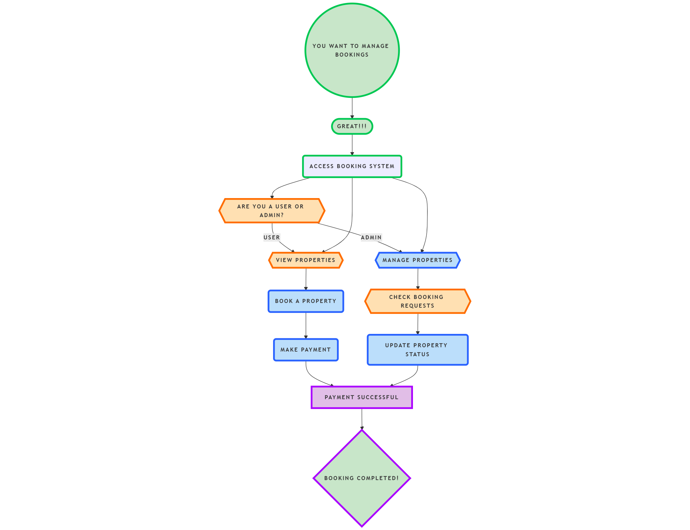

### Requirement Analysis in Software Development

#### Introduction
This repository serves as a comprehensive guide to **Requirement Analysis**, a critical phase in the Software Development Life Cycle (SDLC). Here, we explore the methodologies, techniques, and best practices for gathering, analyzing, and documenting software requirements to ensure successful project delivery.

---

### What is Requirement Analysis?

**Requirement Analysis** is the process of identifying, documenting, and managing the requirements of a system or project. It serves as a bridge between stakeholders and developers, ensuring that the final product meets user needs and business goals.  
This phase involves collaboration among various stakeholders to understand the system's functionalities, limitations, and expectations, creating a roadmap for successful development.

**Importance in the SDLC:**
- Ensures alignment between business needs and technical implementation.
- Reduces project risks and ambiguities.
- Helps create a scalable and efficient system by defining clear requirements.

---

### Why is Requirement Analysis Important?

1. **Clarity and Understanding**
   - Provides a clear, mutual understanding of project goals
   - Reduces ambiguity and misinterpretation among stakeholders
   - Ensures all team members have a unified vision of the project

2. **Scope Definition**
   - Precisely defines the project boundaries
   - Prevents scope creep by establishing clear project limits
   - Helps in managing project expectations and deliverables

3. **Cost and Time Optimization**
   - Enables accurate estimation of project resources
   - Helps in identifying potential challenges early
   - Reduces the risk of costly rework and project delays

---

### Key Activities in Requirement Analysis

**1. Requirement Gathering**
- Conduct stakeholder interviews
- Distribute surveys and questionnaires
- Organize requirement workshops
- Observe end-users in their working environment
- Analyze existing documentation and systems

**2. Requirement Elicitation**
- Facilitate brainstorming sessions
- Conduct focus group discussions
- Create initial prototypes
- Develop proof-of-concept models
- Validate and refine gathered requirements

**3. Requirement Documentation**
- Develop comprehensive requirement specification documents
- Write detailed user stories
- Create use case diagrams
- Document both functional and non-functional requirements
- Maintain traceability matrices

**4. Requirement Analysis and Modeling**
- Prioritize requirements based on business value
- Perform feasibility analysis
- Create visual models (data flow diagrams, entity-relationship diagrams)
- Validate technical and operational constraints
- Align requirements with business objectives

**5. Requirement Validation**
- Review documented requirements with stakeholders
- Verify completeness and accuracy of requirements
- Define clear acceptance criteria
- Obtain stakeholder sign-off
- Establish mechanisms for requirement change management

---

### Types of Requirements

#### Functional Requirements
Functional requirements define specific behaviors and actions the system must perform:
- Search and filter property listings
- User registration and authentication
- Booking management system
- Payment processing
- Notification and communication features

#### Non-functional Requirements
Non-functional requirements describe the system's operational characteristics:
- Performance (response times, concurrent user handling)
- Security (data encryption, access controls)
- Scalability (horizontal scaling, cloud readiness)
- Usability (intuitive interface, accessibility)
- Reliability (system uptime, fault tolerance)

---

### Use Case Diagrams

**What are Use Case Diagrams?**
Use case diagrams provide a visual representation of system interactions, showing:
- Actors (users, external systems)
- Use cases (system functionalities)
- Relationships between actors and use cases

**Benefits of Use Case Diagrams:** 
- Clarify system functionality
- Facilitate stakeholder communication
- Serve as a basis for detailed requirement specifications
- Help in identifying potential system complexities

**Diagram for the Booking Management System:**  
The diagram will include actors such as:
- **User**
- **Admin**
- **Payment Gateway**
  
Use cases will include:
- View properties
- Book a property
- Make payment 

---

### Acceptance Criteria

**What is Acceptance Criteria?**
Acceptance criteria are predefined conditions that a software product must meet to be accepted by stakeholders. They provide a clear, unambiguous definition of feature completeness.

**Example: Booking System Checkout Feature**
1. User must be able to select available dates
2. System should display total cost before confirmation
3. Booking confirmation should be received within 2 minutes
4. Confirmation email must be sent immediately after successful booking
5. Payment gateway integration must be secure and PCI compliant

**Importance in Requirement Analysis:**
- Ensures shared understanding of requirements
- Provides a basis for testing
- Helps in managing stakeholder expectations
- Reduces ambiguity in feature implementation

---

### Conclusion
Effective Requirement Analysis is the foundation of successful software development. By following a structured approach, teams can minimize risks, optimize resources, and deliver software that truly meets user needs.
